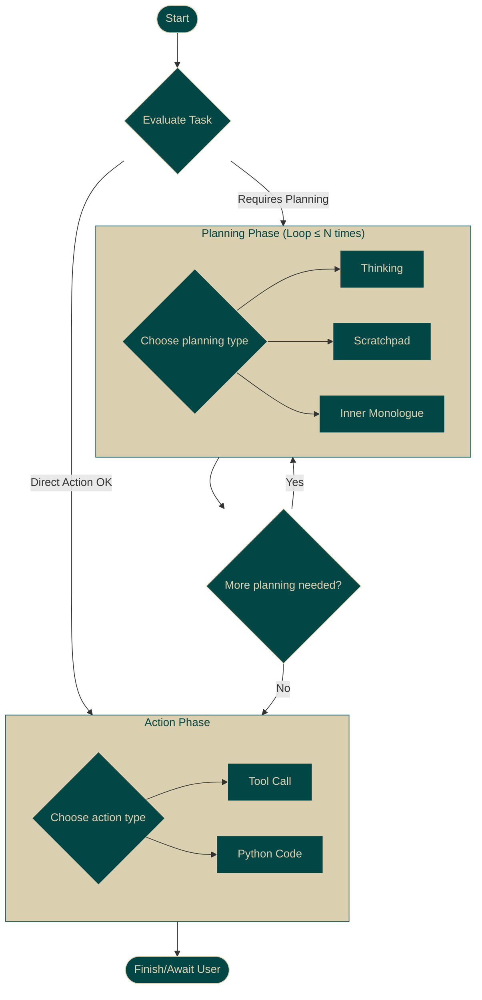

# State Machine

The Proxy Base Agent's (PBA) behavior is governed by an explicit **Hierarchical State Machine (HSM)**. Unlike traditional agents that rely heavily on prompt chaining, PBA uses this state machine, enforced by the underlying Proxy Structuring Engine (PSE), to ensure reliable and predictable execution flow.

## The Core Loop: Plan -> Act

The default PBA state machine defines a fundamental operational cycle:

1.  **Planning Phase:** The agent first evaluates the task. If planning is needed (or forced), it enters a planning loop. Within each loop iteration, it chooses one of the available planning states (`Thinking`, `Scratchpad`, `InnerMonologue`) to analyze the task, break down problems, or formulate strategy. The agent can cycle through this planning loop multiple times (configurable) to refine its approach. PSE ensures the content generated within these states adheres to their defined delimiters (e.g., ```thinking ... ```).

2.  **Action Phase:** Once planning is sufficient, the agent transitions to the action phase. It selects *one* available action state, such as `ToolCallState` (to use an external tool) or `Python` (to execute code). PSE guarantees that the output for the chosen action state conforms to the required structure (e.g., a valid JSON schema for the selected tool call).

3.  **Completion:** After executing the action, the agent typically transitions to a final state, often awaiting further user input or concluding the task.



## Why an HSM?

Using an explicit HSM enforced by PSE provides key advantages:

*   **Reliability:** Prevents the agent from getting stuck, hallucinating invalid actions, or deviating from the intended workflow.
*   **Control:** Allows developers to precisely define and constrain the agent's behavior.
*   **Observability:** Makes the agent's internal state and decision-making process transparent.
*   **Extensibility:** Provides a clear structure for adding new states and capabilities.

This state machine architecture is fundamental to PBA's ability to perform complex tasks reliably. You can learn more about extending this base structure in the [Extending the Agent](../extending/index.md) section.