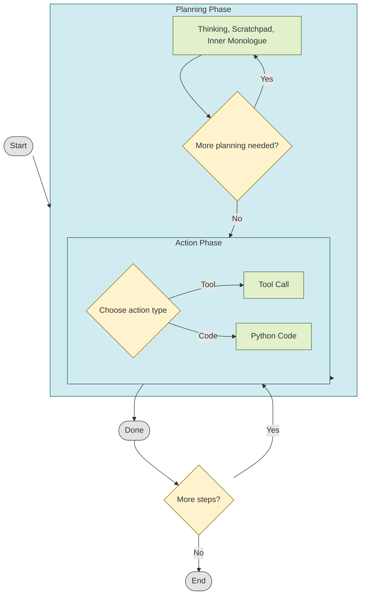

# Proxy Base Agent (Research Preview)

The **Proxy Base Agent (PBA)** is a foundation agent built with the **Proxy Structuring Engine (PSE)**, which provides the underlying framework for managing the agent's state, controlling the flow of execution, and interacting with the language model.

The base agent is designed to **rapidly prototype and develop LLM-powered agents** with a focus on **local execution, stateful interactions, and extensibility**. We invite researchers and developers to experiment with and build upon this foundation.

The **PSE** augments **language models** at runtime, allowing them to function effectively as agents - capable of goal-oriented interactions, multi-step reasoning, and external tool usage.

## What is an Agent?

> An agent is a system that takes actions in an environment.

## PBA Architecture

The agent operates through a structured workflow defined by a **state graph**, transitioning between clearly defined **planning** and **action** phases:



This state graph can be easily modified and extended, allowing for a wide range of agentic behaviors.

## Installation & Quickstart

Prerequisites:

- Python 3.10 or higher
- Linux, macOS, or Windows
- Hardware requirements vary depending on the underlying language model you are using.

Get the Proxy Base Agent running quickly:

```bash
# Install required dependencies
pip install proxy-base-agent

# Launch interactive setup wizard
python -m agent
```

For more detailed guides, see:

- [Installation Guide](getting-started/installation.md)
- [Quickstart Tutorial](getting-started/quickstart.md)


## Core Concepts

Dive into key ideas behind the Proxy Base Agent to fully harness its capabilities:

- [Overview](concepts/overview.md): High-level introduction to the agent.
- [State Graph](concepts/state-graph.md): Directed graph defining agent states and transitions.
- [State Machine](concepts/state-machine.md): Structured workflow governing agent behavior.
- [States](concepts/states.md): Individual components of agent reasoning and actions.
- [Tools](concepts/tools.md): Extendable external interactions and APIs.


## Extending the Agent

Proxy Base Agent is explicitly designed to empower developers to add custom functionality and behaviors:

- [Creating Custom Tools](extending/custom-tools.md): Integrate external APIs or specialized operations.
- [Defining Custom States](extending/custom-states.md): Create new cognitive or action states.
- [Building Custom State Graphs](extending/custom-state-graphs.md): Tailor agent behavior through custom workflows.
- [Model Context Protocol](extending/model-context-protocol.md): The base agent can connect to multiple MCP Servers and add new tools dynamically.

## Running the Agent

The agent is designed vertically, meaning that the model and all data is stored on the machine running the agent.

Run the agent with:

```bash
python -m agent
```

which will launch an interactive setup wizard in your terminal.

## Language Models

LLMs from your local huggingface cache will be used, or you can download a model from the Huggingface Hub during setup.

Ideally any model that is supported by the Huggingface Transformers library will work with the base agent; with instruct tuned models performing best.

## API Inference

We do not currently provide a hosted version of the base agent, or an off-the-shelf API.

The base agent currently supports multiple inference frontends via the Huggingface Transformers library; with tested support for MLX & PyTorch; with planned support for VLLM, SGLang, TensorFlow, and Jax.

The base agent requires access to a language models tokenizer and sampling logic - this is currently only supported for local models.

## Research Preview

We are sharing the base agent in its current state for research purposes.

It will be maintained as a research project, and is not intended for direct production use.

Those interested in using the base agent commercially can purchase a license from us.
*This supports the open source nature of the project*.

## License

We offer personal and commercial licenses for those interested in using the base agent in their own projects.

We invite meaningful contributions to the project, and afford free commercial licenses to those who contribute to the project.

---

[View on GitHub](https://github.com/TheProxyCompany/proxy-base-agent){: .md-button .md-button--primary }
