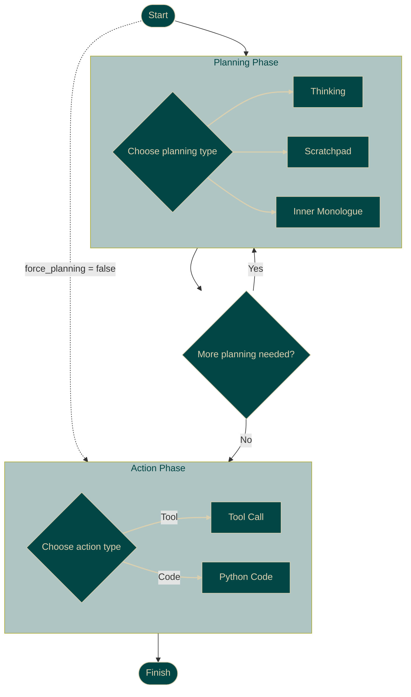

# Proxy Base Agent

The **Proxy Base Agent (PBA)** is a foundation agent built with the **Proxy Structuring Engine (PSE)**, which provides the underlying framework for managing the agent's state, controlling the flow of execution, and interacting with the language model.

The base agent is designed to **rapidly prototype and develop LLM-powered agents** with a focus on **local execution, stateful interactions, and extensibility**.

The **PSE** augments **language models** at runtime, allowing them to function effectively as agents - capable of adhering to predefined workflows, multi-step reasoning, and external tool usage.

## What is an Agent?

> An agent is a system that takes actions in an environment.

## Proxy Base Agent

The Proxy Base Agent operates through a structured workflow defined by a **state graph**, transitioning through clearly defined **planning** and **action** phases:



### Planning Phase

The agent first enters a planning loop, choosing between internal states to reason about the task:

*   **Thinking**: Deliberate analysis and planning.
*   **Scratchpad**: Quick notes and working memory.
*   **Inner Monologue**: Detailed self-reflection and narrative reasoning.

### Action Phase

Once planning is complete, the agent selects an action to interact with the environment:

*   **Tool Calls**: Invokes external tools or APIs via guaranteed schemas.
*   **Python Code Execution**: (Optional) Runs Python code snippets.

### State Graph

This state graph describes the base behavior of the agent.
It can be extended and modified to support more complex agentic behaviors.

## Key Capabilities

PBA leverages PSE to deliver capabilities beyond conventional agent frameworks:

*   **Guaranteed Stateful Execution:** Define agent workflows as explicit HSMs (e.g., Plan ➔ Act). PSE ensures the LLM follows the defined states and transitions precisely.
*   **100% Reliable Tool Use:** Eliminate runtime errors from malformed API calls or hallucinated function arguments. PSE guarantees tool calls match their required schema during generation.
*   **Dynamic Runtime Adaptation (MCP):** Connect to external Model Context Protocol (MCP) servers on-the-fly. PBA instantly integrates new tools and capabilities with the same structural guarantees, no restarts needed.
*   **Model & Framework Agnostic:** Run reliable agents locally using your preferred LLMs and backends (MLX, PyTorch supported).
*   **Modular & Extensible:** Build specialized agents by adding custom tools, defining new states, or modifying the core HSM architecture.

## Installation & Quickstart

Prerequisites:

- Python 3.10 or higher
- Linux, macOS, or Windows
- Hardware requirements vary depending on the underlying language model you are using.

Get the Proxy Base Agent running quickly:

```bash
# Install required dependencies
pip install proxy-base-agent

# Launch interactive setup wizard
python -m agent
```

# More Information

For more detailed guides, see:

- [Installation Guide](getting-started/installation.md)
- [Quickstart Tutorial](getting-started/quickstart.md)

- [Core Concepts](concepts/index.md)
- [Extending the Agent](extending/index.md)
- [Frontends](frontends/index.md)

---

[View on GitHub](https://github.com/TheProxyCompany/proxy-base-agent){: .md-button .md-button--primary }
