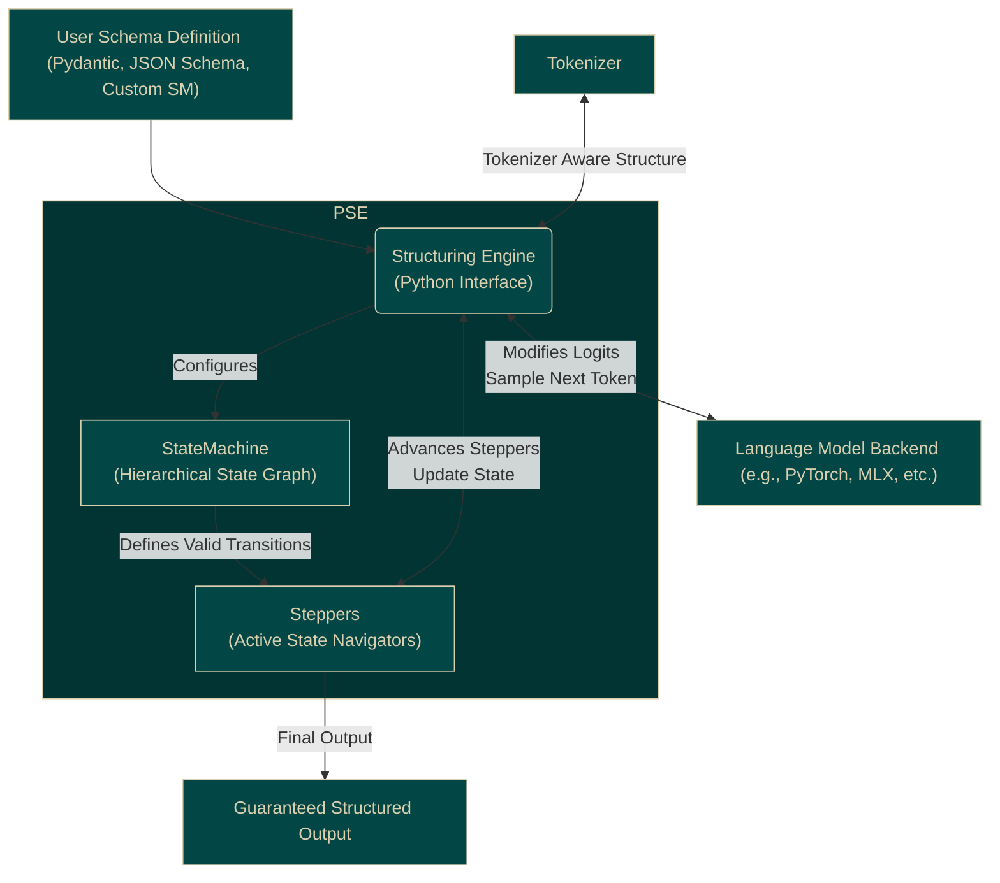

# Core Architecture

The Proxy Structuring Engine (PSE) achieves its structural guarantees through a layered architecture that tightly integrates grammar definition, state tracking, and language model interaction at runtime.

## Key Components

1.  **User Schema Definition:** Developers define the desired output structure using familiar Python tools like Pydantic models, standard JSON Schema, Python function signatures, or by composing PSE's base `StateMachine` types (`Chain`, `Loop`, etc.).
2.  **`StructuringEngine` (Python Interface):** This is the main entry point. It takes the user's schema definition and the LLM's tokenizer. It translates the schema into the internal `StateMachine` representation and manages the interaction with the LLM during generation via the `process_logits` and `sample` hooks.
3.  **`StateMachine` (Core Concept):** Represents the defined grammar as a hierarchical state graph. Each node is a state, and edges are transitions validated by potentially nested `StateMachine`s. This graph defines all valid sequences of tokens according to the structure.
4.  **`Stepper` (Core Concept):** Represents an active position or hypothesis within the `StateMachine` graph. The `StructuringEngine` maintains one or more active `Stepper`s to track all possible valid paths through the grammar simultaneously. Steppers use the `StateMachine` to determine valid next moves.
5.  **Tokenizer:** Provided by the user (typically from the LLM framework), used by the `StructuringEngine` to map between strings and token IDs for vocabulary lookups, token healing, and multi-token processing.
6.  **LLM Backend:** The underlying language model (e.g., running via `transformers`). PSE integrates by intercepting the logits before sampling.
7.  **Output Reconstruction:** After generation finishes (a `Stepper` reaches an end state), the `StructuringEngine` uses the `Stepper`'s history and tracked token IDs to reconstruct the final output string accurately and parse it into the desired Python object.

## Runtime Enforcement Loop

The core guarantee comes from the tight loop during generation:

1.  LLM generates logits for the next token.
2.  `StructuringEngine.process_logits` queries all active `Stepper`s for valid next tokens based on their current state in the `StateMachine`.
3.  `process_logits` masks the logits, setting the probability of invalid tokens (those violating the grammar) to negative infinity.
4.  `StructuringEngine.sample` takes the masked logits and uses a base sampler.
5.  The sampled (guaranteed valid) token ID is used to advance the active `Stepper`s to their next state(s) via `Stepper.consume`.
6.  This loop repeats until an end state is reached.

This runtime enforcement ensures that every generated token strictly adheres to the structure defined by the `StateMachine`, eliminating the possibility of schema violations. Features like Token Healing and Multi-Token Processing add robustness and efficiency to this core loop.
