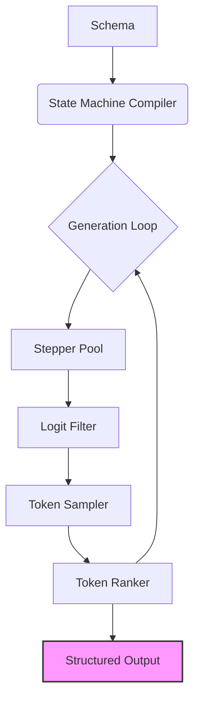

# Proxy Structuring Engine

The **Proxy Structuring Engine** (PSE) is a system for dynamically constrained natural language generation. It compiles rules and schemas into efficient hierarchical state machines that dynamically filter token probabilities during generation, guaranteeing structurally valid outputs while preserving natural language fluency. Think of it as laying down train tracks for the language model to follow as it generates text.

## Use Cases
- **Tool Calling** - Generate precise, validated parameters for function calls
- **Synthetic Data** - Create diverse, schema-conformant datasets for training
- **API Integration** - Guarantee well-formed outputs for seamless system interoperability
- **Structured Output** - Enforce type-safe results for reliable downstream processing
- **Agent Frameworks** - Constrain agent actions and reasoning (see [Proxy Base Agent](https://github.com/TheProxyCompany/proxy-base-agent))

## Key Advantages
- **Dynamic Validation** - A hierarchical state machine validates each token generated, ensuring structural correctness during generation
- **Token Healing** - Intelligently recovers from tokenization mismatches, maintaining structural integrity
- **Parallel Generation** - Explores multiple potential output paths concurrently, maximizing quality within constraints
- **Framework Agnostic** - Integrates seamlessly with PyTorch, MLX, TensorFlow, and JAX
- **Minimal Overhead** - Adds less than 20ms per token, making it suitable for latency-sensitive applications
- **Schema Versatility** - Supports JSON Schema, Pydantic models, custom grammars, and custom state machines for maximum flexibility

## Architectural Overview



1. **Schema Compilation** - Your defined structure (e.g., JSON Schema) is compiled into an efficient, hierarchical state machine
2. **Constrained Generation** - During text generation, the state machine guides the process:
    - **Stepper Pool** - Manages multiple potential generation paths (hypotheses)
    - **Logit Filtering** - Masks invalid tokens based on the current state, enforcing constraints
    - **Token Sampling** - Selects one or more next tokens from the filtered distribution
    - **Token Ranker** - Prunes invalid or low-probability branches, selecting the most promising continuation
3. **Structured Output** - The final, validated output is guaranteed to conform to the provided schema

This architecture provides:
- **Guaranteed Validity** - Outputs are always structurally correct
- **Creative Flexibility** - The model retains its generative power within the defined constraints
- **Robust Error Handling** - Automatic correction of tokenization issues ensures resilience

## Getting Started

```python
from pse import StructuringEngine
from pydantic import BaseModel
from transformers import AutoTokenizer

# 1. Define your desired output structure
class User(BaseModel):
    name: str
    age: int

# 2. Initialize the tokenizer and engine
tokenizer = AutoTokenizer.from_pretrained("your-model-name")
engine = StructuringEngine(tokenizer)

# 3. Configure the engine with your schema
engine.configure(User.schema())

# 4. Integrate with your generation loop
# (Example using Hugging Face Transformers)
output = model.generate(
    ...,
    logits_processor=[engine.process_logits],
    sampler=engine.sample, # Use the engine's sampling method for multi-token generation
)

# 5. Extract the structured output
structured_user = engine.get_structured_output(User, raise_on_error=True)
print(structured_user)

```

## Open Source
PSE is released under the Apache 2.0 license.

We enthusiastically welcome community contributions and collaborations.

[Explore the Code](https://github.com/TheProxyCompany/proxy-structuring-engine){: .md-button .md-button--primary }
[Report an Issue](https://github.com/TheProxyCompany/proxy-structuring-engine/issues){: .md-button }
[Contribute](https://github.com/TheProxyCompany/proxy-structuring-engine/blob/main/CONTRIBUTING.md){: .md-button }
