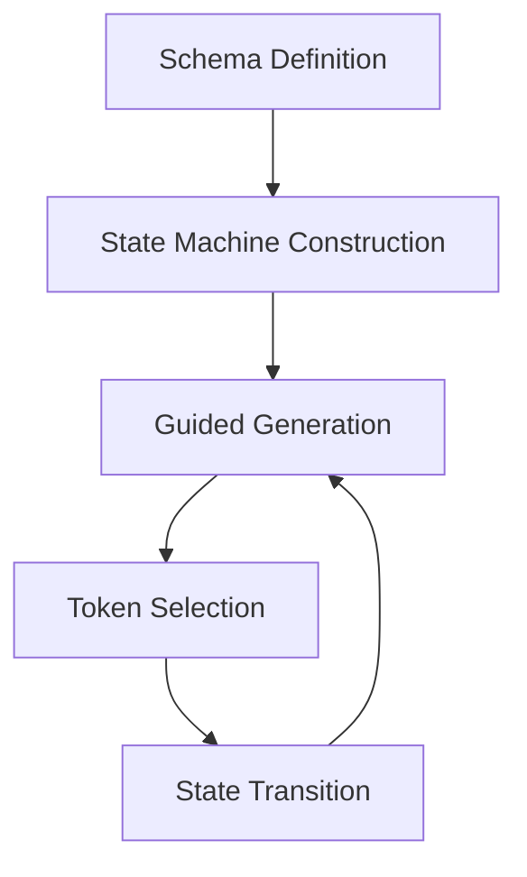

# Key Features

The Proxy Structuring Engine (PSE) offers a comprehensive set of features that make it the leading solution for generating reliable structured outputs from language models.

## State Machine Architecture

PSE's core innovation is its hierarchical state machine architecture, which:

- Guides LLM generation token-by-token to enforce structural validity
- Represents complex nested structures with hierarchical states
- Maintains context at multiple levels simultaneously
- Provides mathematical guarantees about output structure

## Token Healing

PSE's token healing technology automatically recovers from minor errors during generation:

- Identifies and corrects token deviations that would break structure
- Assigns partial credit to valid token prefixes
- Handles whitespace and formatting variations gracefully
- Maintains the model's semantic intent while ensuring syntactic correctness

## Framework Agnostic

PSE is designed to work with all major machine learning frameworks:

- **PyTorch**: Full integration with HuggingFace Transformers and PyTorch models
- **MLX**: Native support for Apple's MLX framework on M-series Macs
- **TensorFlow**: Seamless integration with TensorFlow models
- **JAX**: Support for JAX-based models and transformations

## Minimal Overhead

PSE is engineered for production performance:

- Only ~20ms additional processing time per token
- Zero-copy tensor operations minimize memory overhead
- Computation scales linearly with grammar complexity, not exponentially
- Efficient C++ core with optimized memory management

## Schema Flexibility

PSE supports multiple ways to define output structures:

- **JSON Schema**: Industry-standard JSON Schema specifications
- **Pydantic Models**: Direct integration with Pydantic for Python users
- **Custom Grammars**: Support for arbitrary grammar definitions
- **Composite Engines**: Combine free-form and structured generation

## Parallel Path Exploration

For handling grammatical ambiguity, PSE employs sophisticated techniques:

- Explores multiple interpretations of the generation simultaneously
- Assigns probabilities to different paths based on model preferences
- Prunes unlikely paths for efficiency
- Selects the most promising valid path

## Composability

PSE supports composition of multiple generation modes:

- **Thinking + Structured Output**: Allow models to reason in natural language before producing structured results
- **Multiple Structures**: Seamlessly transition between different structures
- **Context-Aware Transitions**: Define context-sensitive delimiters for transitions

## Error Resilience

PSE is designed to handle unexpected conditions gracefully:

- Provides detailed error information when generation fails
- Maintains partial results for debugging
- Offers fallback mechanisms for critical applications
- Includes comprehensive logging options

## Tokenizer Independence

PSE works with any tokenizer:

- Compatible with subword tokenizers (BPE, WordPiece, etc.)
- Handles multi-token entity representations
- Works with character-level and word-level tokenizers
- Adapts to model-specific tokenization peculiarities